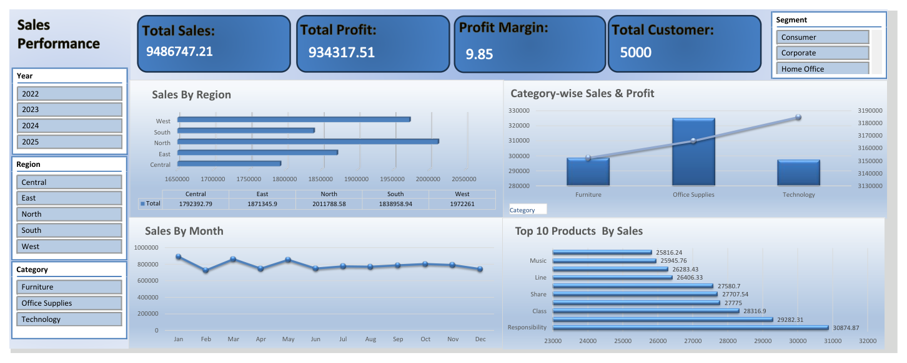
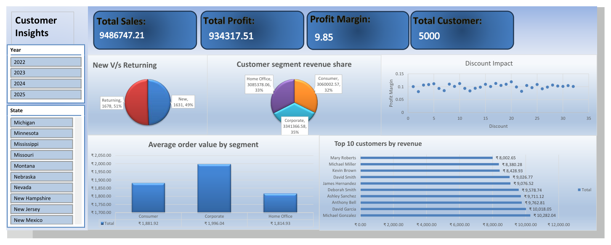
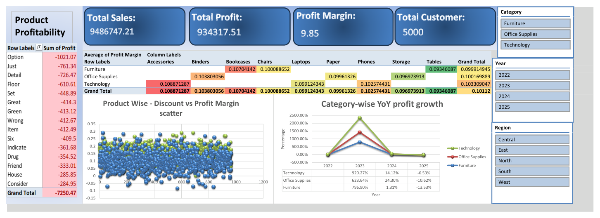
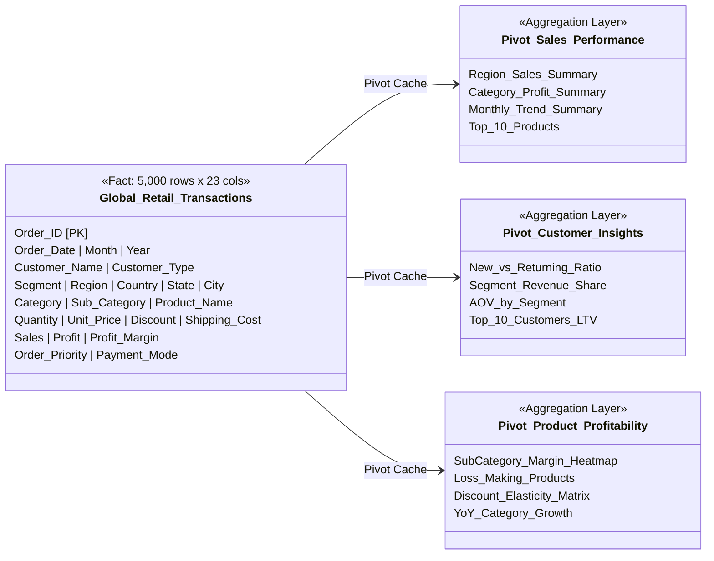

# 📊 Global Retail Sales & Profit Analysis Dashboard (Excel)

[](https://www.microsoft.com/excel)
[](https://support.microsoft.com/en-us/office/create-a-pivottable-to-analyze-worksheet-data-a9a84538-bfe9-40a9-a8e9-f99134456576)
[](https://en.wikipedia.org/wiki/Retail_analytics)
[](LICENSE)
[](https://www.linkedin.com/in/harshjadav0901/)

A multi-tiered, executive-grade **Business Intelligence & Financial Analytics Dashboard** engineered in **Microsoft Excel**. 

This project transforms **5,000 global retail transactions ($9.49M in sales)** spanning **2022 to 2025** into interactive, decision-ready dashboards that track revenue performance, customer lifetime behavior, discount elasticity, and product profitability.

---

## 📌 Executive Summary & Key Performance Indicators (KPIs)

| Metric | Value | Business Context |
|:---|:---:|:---|
| **Gross Revenue** | **$9,486,747.21** | Total worldwide sales across 3 operating fiscal years |
| **Total Net Profit** | **$934,317.51** | Operating bottom-line profit after shipping & discounts |
| **Blended Profit Margin** | **9.85%** | Consistent ~10% margin maintained across all 3 major categories |
| **Total Order Volume** | **5,000 Orders** | Transactional volume with an average order value of **$1,897.35** |
| **Top Category by Profit** | **Technology ($325.8K)** | Highest margin yield ($10.33\%$) vs Furniture ($9.47\%$) |
| **Leading Revenue Region** | **North ($2.01M)** | Outperformed West ($1.97M), East ($1.87M), and South ($1.84M) |
| **Primary Customer Segment** | **Corporate (35.2%)** | Generates highest sales ($3.34M) and highest AOV ($1,996.04) |
| **Identified Product Losses** | **-$7,250.47** | Isolated in 12 chronic loss-making products flagged for rationalization |

---

## 🖥️ Interactive Dashboard Architecture & Tour

The workbook features **three specialized interactive dashboards** powered by dynamic Pivot Tables, Calculated Fields, Slicers, and Conditional Formatting.

### 🔹 Dashboard 1 — Sales Performance
> Executive high-level monitoring of gross sales, net profit, geographic concentration, and top-selling merchandise.



#### Core Features & Visuals:
- **Executive Metric Cards:** Instant visibility into Gross Sales ($9,486,747.21), Net Profit ($934,317.51), Profit Margin ($9.85\%$), and Customer Base ($5,000$).
- **Regional Sales Distribution (Horizontal Bar):** Ranks regional revenue led by North ($$2.01\text{M}$), West ($$1.97\text{M}$), East ($$1.87\text{M}$), South ($$1.84\text{M}$), and Central ($$1.79\text{M}$).
- **Category-Wise Sales & Profit (Combo Dual-Axis):** Highlights revenue volume against profitability across Furniture, Office Supplies, and Technology.
- **Monthly Revenue Seasonality (Line Chart):** Tracks monthly billing trajectory identifying peak procurement cycles.
- **Top 10 Products by Sales Volume:** Highlights high-velocity items led by *Responsibility* ($$30,874.87$) and *Class* ($$28,316.90$).
- **Multi-Parameter Slicers:** Interactive filtering by Year (`2022`, `2023`, `2024`, `2025`), Region, Category, and Customer Segment.

---

### 🔹 Dashboard 2 — Customer Insights
> Granular customer segmentation, retention analysis, segment economics, and discount elasticity.



#### Core Features & Visuals:
- **New vs. Returning Customer Share (Donut):** Demonstrates healthy balance between Returning repeat buyers ($51\%$, $1,678$ orders) and New client acquisition ($49\%$, $1,631$ orders).
- **Segment Revenue Contribution (3D Pie):** Corporate accounts lead with **$35\%$** ($$3.34\text{M}$), followed by Home Office at **$33\%$** ($$3.09\text{M}$) and Consumer at **$32\%$** ($$3.06\text{M}$).
- **Average Order Value (AOV) by Segment:** B2B Corporate buyers average **$1,996.04** per transaction, compared to Consumer ($$1,881.92$) and Home Office ($$1,814.93$).
- **Top 10 Customers by Lifetime Value:** Ranked by revenue, led by Michael Gonzalez ($$10,282.04$), David Garcia ($$10,018.05$), and Anthony Bell ($$9,762.81$).
- **Discount Impact on Profitability (Scatter Plot):** Correlates applied discount percentages against realized profit margins to ensure discount discipline.

---

### 🔹 Dashboard 3 — Product Profitability & Risk Mitigation
> Bottom-line profit margin diagnostic, sub-category cross-tabulation, and negative-margin product alerts.



#### Core Features & Visuals:
- **High-Loss Product Identification Table:** Conditional formatting highlights 12 products dragging down net earnings (led by *Option* at $-\$1,021.07$, *Just* at $-\$761.34$, and *Detail* at $-\$726.47$).
- **Category vs. Sub-Category Margin Heatmap:** Cross-tabulates profit margins across all 9 sub-categories, identifying high-margin drivers (Accessories at $10.89\%$, Bookcases at $10.70\%$) versus low-margin segments (Tables at $9.35\%$).
- **Discount vs. Profit Margin Product Scatter:** Evaluates 5,000 order points to detect margin leakage.
- **Year-over-Year Profit Growth Trend:** Compares annual profitability trajectories across all three primary product divisions.

---

## 🏗️ Data Architecture & Modeling



### Data Schema Dictionary

| Group | Attributes | Type | Description |
|:---|:---|:---:|:---|
| **Order Metadata** | `Order ID`, `Order Date`, `Month`, `Year`, `Order Priority` | Dimension | Unique order identifier, chronological timestamps, and SLA urgency level |
| **Customer Profile** | `Customer Name`, `Customer Type`, `Segment` | Dimension | Customer identity, cohort classification (`New`, `Returning`, `VIP`), and market segment |
| **Geography** | `Region`, `Country`, `State`, `City` | Dimension | Regional hierarchy covering Central, East, North, South, and West territories |
| **Merchandise** | `Category`, `Sub-Category`, `Product Name` | Dimension | 3-tier catalog hierarchy: Furniture, Office Supplies, Technology |
| **Unit Economics** | `Quantity`, `Unit Price`, `Discount`, `Shipping Cost` | Measure | Transaction quantity, list unit pricing, promotional discounts ($0-30\%$), and freight |
| **Financial KPIs** | `Sales`, `Profit`, `Profit Margin`, `Payment Mode` | Measure | Net top-line revenue, realized profit, calculated margin percentage, and payment method |

---

## 💡 Strategic Business Insights & Recommendations

```
REGIONAL REVENUE & PROFIT RANKING ($)
================================================================================
North    Sales: $2,011,789 | Profit: $201,873 (10.03% Margin) ████████████████
West     Sales: $1,972,261 | Profit: $188,278 (9.55% Margin)  ███████████████
East     Sales: $1,871,346 | Profit: $193,067 (10.32% Margin) ██████████████
South    Sales: $1,838,959 | Profit: $176,824 (9.62% Margin)  █████████████
Central  Sales: $1,792,393 | Profit: $174,275 (9.72% Margin)  ████████████
================================================================================
```

1. **Prioritize Corporate B2B Retention:**
   - The **Corporate segment** generates the highest revenue ($$3.34\text{M}$, $35.2\%$ share) and achieves the highest Average Order Value ($$1,996.04$ vs $$1,814.93$ for Home Office).
   - **Recommendation:** Create dedicated corporate volume accounts and enterprise SLA support to further expand contract sizes.

2. **Rationalize Negative-Margin Products:**
   - The profitability audit detected **12 recurring loss-making products** (including *Option*, *Just*, *Detail*, *Floor*, *Set*) generating cumulative losses of **$-\$7,250.47$**.
   - **Recommendation:** Immediately review supplier unit costs, establish a minimum price floor, or discontinue standalone orders of these items.

3. **Sub-Category Margin Optimization:**
   - **High Performers:** Accessories ($10.89\%$), Bookcases ($10.70\%$), and Binders ($10.38\%$) generate the healthiest unit economics.
   - **Low Performers:** Tables ($9.35\%$) and Storage ($9.69\%$) absorb high shipping and packaging costs that compress net margins.
   - **Recommendation:** Implement dynamic shipping surcharges on bulky furniture like Tables.

4. **Discount Policy Governance:**
   - Transaction analysis reveals that discounts between **$1\%$ and $20\%$** preserve solid operating margins (~$10\%$). However, discounts above $20\%$ fail to generate meaningful incremental order volume while cannibalizing margin dollars.
   - **Recommendation:** Cap discretionary sales rep discounts at $15\%$ and require regional manager approval for discounts exceeding $20\%$.

---

## 📂 Repository Structure

```text
Global-Retail-Sales-Profit-Analysis-Excel-Dashboard/
├── assets/
│   ├── sales_performance_dashboard.png       # Dashboard 1: Revenue & regional performance preview
│   ├── customer_insights_dashboard.png       # Dashboard 2: Customer LTV & segmentation preview
│   └── product_profitability_dashboard.png   # Dashboard 3: Margin heatmap & loss alerts preview
├── dashboards/
│   └── Global retail Sales Dashboard By Harsh.xlsx  # Multi-sheet interactive Excel BI dashboards
├── data/
│   ├── Raw_Data.xlsx                         # Source transactional Excel spreadsheet (5,000 rows)
│   └── global_retail_dataset.csv             # Lightweight CSV format for quick web inspection
├── .gitignore                                # Excludes temporary Excel lockfiles & system artifacts
├── LICENSE                                   # MIT Open-Source License
└── README.md                                 # Executive project documentation & analysis
```

---

## 🚀 How to View & Explore the Dashboards

1. **Clone or Download the Repository:**
   ```bash
   git clone https://github.com/jadavharsh109/Global-Retail-Sales-Profit-Analysis-Excel-Dashboard.git
   ```
2. **Open the Dashboard:**
   - Open `dashboards/Global retail Sales Dashboard By Harsh.xlsx` in **Microsoft Excel 2016+** or **Microsoft 365**.
3. **Enable Content & Connections:**
   - Click **Enable Editing / Enable Content** if prompted by Excel's protected view.
4. **Interact with Visual Slicers:**
   - Navigate across the `Sales_performance`, `Customer insights`, and `Product Profitability` sheets.
   - Click any Slicer button (Year, Region, Segment, Category, State) to dynamically filter all connected charts and KPI cards in real time.

---

## 👤 Author & Contact

**Harsh Jadav**  
*Data Analyst | Data Scientist*

[](https://www.linkedin.com/in/harshjadav0901/)
[](https://github.com/jadavharsh109)

---
*If you find this retail analytics project valuable, please give this repository a ⭐ star!*
